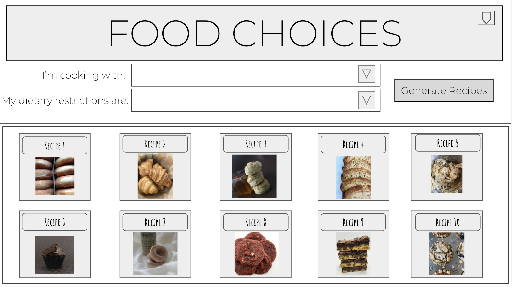
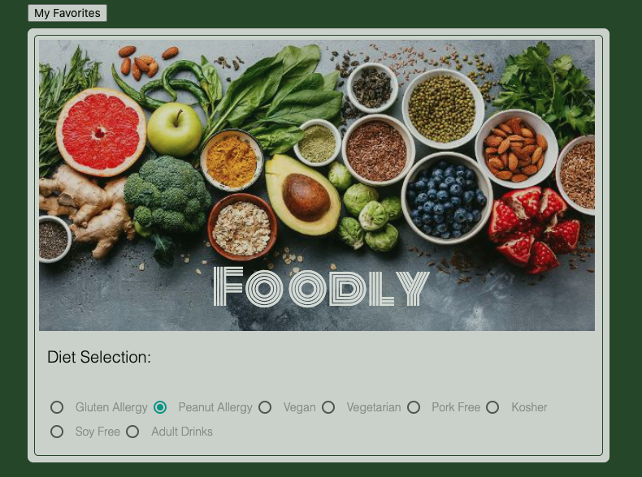
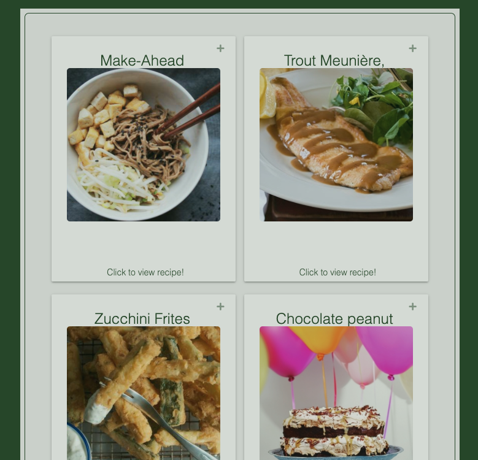

# Foodly

## Description

It's not always an enjoyable experience to hunt for food recipes, especially if you have dietary restrictions.

This application provides users with food recipe choices based on those restrictions.

## User Story

    AS A User with Dietary restrictions
    I WANT to search for recipes according to my needs
    SO THAT I can get great recipe ideas

## Acceptance Criteria
    
    GIVEN that a user is presented with dietary restricitons to choose from.
    WHEN the user clicks on the dietary restriction
    THEN the user should be presented with 50 recipe choices in cards.
    
    GIVEN that a user has been presented with recipe choices
    WHEN the user favorites a recipe by clicking an icon inside the card
    THEN the recipes should be stored in localStorage, to be later viewed again.
    
    GIVEN that a user wants to recall a recipe previously favorited
    WHEN the user clicks the 'My Favorites' button
    THEN the recipes stored will appear.

## Link to Deployed Website
This site is hosted at:  https://celestealexmoore.github.io/Project-1/

## Wireframes
 

## Screenshots
 
 

## APIs Used
* [Edamam Recipe Search](https://developer.edamam.com/edamam-docs-recipe-api)
* [Edamam Nutrition Analysis](https://developer.edamam.com/edamam-docs-nutrition-api)

## Design Framework 
* [Materialize](https://materializecss.com/)

## Roles
### 🎨 Frontend Developer/Designer: 
* [Celeste Moore](https://github.com/celestealexmoore)
### Backend Developers: 
* [Celeste Moore](https://github.com/celestealexmoore)
* [Mohammed Ottun](https://github.com/MohammedOttun)
### 🥸  Quality Assurances: 
* [Celeste Moore](https://github.com/celestealexmoore)
* [Terence Chaney](https://github.com/tchaney0327)
* [Cesar De La Portilla](https://github.com/DLP713)
* [Mohammed Ottun](https://github.com/MohammedOttun)

### Student Grading Reference

| Letter |      Name            |
|:------:|:--------------------:| 
|   A    | Mohammed Ottun       |
|   B    | Cesar De La Portilla |
|   C    | Terrence Chaney      |
|   D    | Celeste Moore        |

